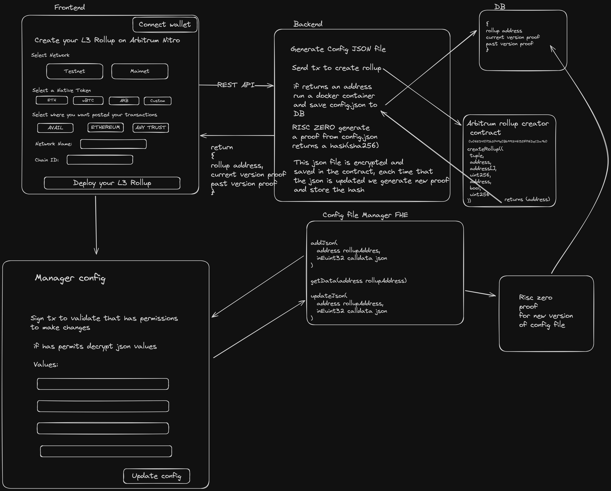

# Fruit Rush L3 Creator

Easy l3 roll ups deployments with custom DA + F.H.E and Z.K.P secured.  

Fruit Rush democratize the creation of powerful App-Chains(L3) solutions,  
that foster digital inclusion and drive positive global impact. By providing an innovate no-code platform

## Tech Stack

- [Arbitrum Orbits](https://docs.arbitrum.io/launch-orbit-chain/how-tos/orbit-sdk-deploying-anytrust-chain)
- [Avail DA](https://docs.availproject.org/docs/build-with-avail/overview)
- [RISC Zero](https://dev.risczero.com/api/generating-proofs/remote-proving)
- [Homomorphic Encryption with Fhenix](https://docs.fhenix.zone/docs/devdocs/intro)

## Repositories

*[Docker configs](https://github.com/fruteroclub/fruit_rush)

*[Risc zero](https://github.com/fruteroclub/risc0/commit/6472a4d07f155957f5039e2261689cbfb9003e9b)
**note: we fork risc zero example repos, but we modify the json example to use with our config.json files**

*[FHE implementation](https://github.com/fruteroclub/key_manager)
**Currently fhenix doesn't work with strings**

## Transactions

**Create Rollup**

- [https://sepolia.arbiscan.io/tx/0xe3cb6ec5d32122e28f5d4c3f9e61db189ecbcf986ca2da06673e32c2186b0f38](https://sepolia.arbiscan.io/tx/0xe3cb6ec5d32122e28f5d4c3f9e61db189ecbcf986ca2da06673e32c2186b0f38)

- [https://sepolia.arbiscan.io/tx/0xe3879540aa15221f4678cea5c22f6755cc83d9ddc670911954cde26cef7e28d9](
    https://sepolia.arbiscan.io/tx/0xe3879540aa15221f4678cea5c22f6755cc83d9ddc670911954cde26cef7e28d9
)

- [https://sepolia.arbiscan.io/tx/0x3b51700917b4f32885f968b12ddadbe105d1f005f834ba543de45f9cc62e5859](
    https://sepolia.arbiscan.io/tx/0x3b51700917b4f32885f968b12ddadbe105d1f005f834ba543de45f9cc62e5859
)

**DA Setup**

- [https://sepolia.arbiscan.io/tx/0xae142d5cdef027b86964cdabd11a0151cc6b071128870c6fdc5abfebf213a508](https://sepolia.arbiscan.io/tx/0xae142d5cdef027b86964cdabd11a0151cc6b071128870c6fdc5abfebf213a508)

## Arbitrum  Precompile

We are ideate a precompile using fhe to get optional extra privacy to our users

## Diagram and Overview

We've developed an innovative no-code platform that empowers developers and organizations to seamlessly integrate into the web3 ecosystem, tailoring it specifically for application chains. This platform plays a pivotal role in ushering in the next billion users by leveraging the scalability of Arbitrum's Orbit chains and recording transactions through Avail.

We are using `RISC Zero` to generate a zk-proof each time that the app chain get new values. This method ensures the integrity of historical data without exposing sensitive information, such as private keys found in JSON files. Looking ahead, we plan to enhance security by incorporating `Fully Homomorphic Encryption (FHE)` to safeguard and simplify the management of Layer 3 configuration files.

This SAAS solution not only fosters broader adoption by enabling DApp chain creators to concentrate on their unique use cases and achieve **product-market fit**, but it also addresses the infrastructure and technical challenges they face. We're here to support the visionary creators at the forefront of digital transformation, making their journey smoother and their innovations more accessible.

## Create T3 App

This is a [T3 Stack](https://create.t3.gg/) project bootstrapped with `create-t3-app`.

## What's next? How do I make an app with this?

We try to keep this project as simple as possible, so you can start with just the scaffolding we set up for you, and add additional things later when they become necessary.

If you are not familiar with the different technologies used in this project, please refer to the respective docs. If you still are in the wind, please join our [Discord](https://t3.gg/discord) and ask for help.

- [Next.js](https://nextjs.org)
- [NextAuth.js](https://next-auth.js.org)
- [Prisma](https://prisma.io)
- [Drizzle](https://orm.drizzle.team)
- [Tailwind CSS](https://tailwindcss.com)
- [tRPC](https://trpc.io)

## Learn More

To learn more about the [T3 Stack](https://create.t3.gg/), take a look at the following resources:

- [Documentation](https://create.t3.gg/)
- [Learn the T3 Stack](https://create.t3.gg/en/faq#what-learning-resources-are-currently-available) — Check out these awesome tutorials

You can check out the [create-t3-app GitHub repository](https://github.com/t3-oss/create-t3-app) — your feedback and contributions are welcome!

## How do I deploy this?

Follow our deployment guides for [Vercel](https://create.t3.gg/en/deployment/vercel), [Netlify](https://create.t3.gg/en/deployment/netlify) and [Docker](https://create.t3.gg/en/deployment/docker) for more information.
